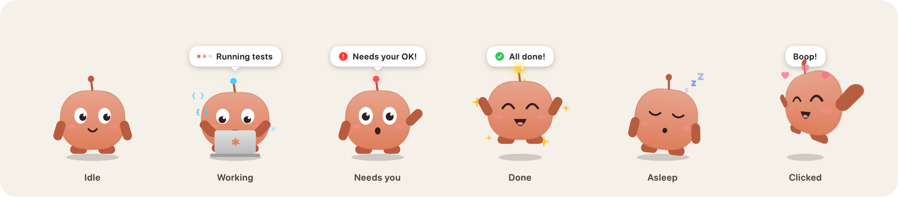
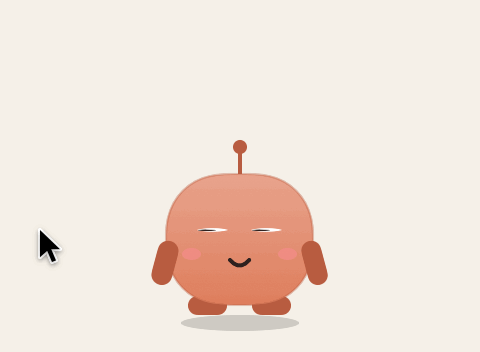
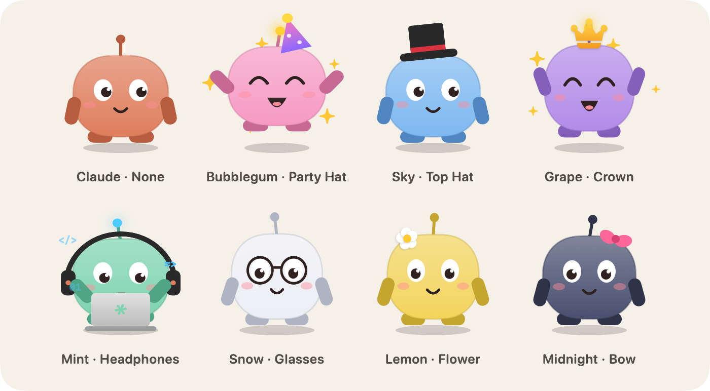
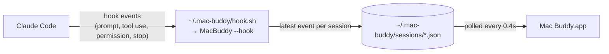

<div align="center">


# Mac Buddy

**A tiny desktop companion that lives on your Mac's screen and reacts while [Claude Code](https://claude.com/claude-code) works.**

It types on its laptop while Claude is busy, waves when Claude needs your permission, celebrates when the task is done, and naps when nothing's going on.

[](https://github.com/mohsin2596/mac-buddy/releases/latest)
[](#install)
[](https://swift.org)
[](#install)
[](LICENSE)
[](#contributing)

[Install](#install) · [Features](#features) · [Customize](#customize) · [How it works](#how-it-works) · [FAQ](#faq)

</div>

---

## Features

<p align="center">
  
</p>

- 🧑‍💻 **Knows what Claude is doing.** A speech bubble shows the current step, like *"my-app · Running tests"* or *"Editing App.swift"*, plus a `×2` badge when several sessions are busy at once.
- ☕️ **Has a little routine while working.** It mostly types, but takes breaks to sip coffee, read, think and juggle.
- 🙋 **Gets your attention.** When Claude is waiting on a permission prompt, it waves and shows a red bubble.
- 🎉 **Celebrates** when Claude finishes a task.
- 😴 **Falls asleep** when nothing's happening, and wakes up when you click it.
- 👆 **Reacts to clicks** with a spin, backflip, boing, wave or giggle, and gets dizzy if you click it too much. You can also write your own lines for it to say.
- 👀 **Eyes follow your cursor** anywhere on screen (optional).
- 🪟 **Stays out of your way.** It floats above your windows on every Space, clicks next to it go straight through to whatever is underneath, and clicking it never takes focus away from your terminal.
- 🎨 **Highly customizable.** Size, colors, accessories, shape, behavior and more, all applied live.
- 🪶 **Lightweight.** A single native Swift app with no Electron, no web views and no dependencies.

<p align="center">
  
</p>

## Install

**Requirements:** macOS 14 Sonoma or later (Apple silicon or Intel) and [Claude Code](https://claude.com/claude-code). Nothing else.

### Option 1: Download the app

<a href="https://github.com/mohsin2596/mac-buddy/releases/latest/download/MacBuddy.dmg"></a>

1. Open `MacBuddy.dmg` and drag **Mac Buddy** into **Applications**.
2. Open Mac Buddy from Applications.
3. Click **Connect** when it asks to connect to Claude Code, then restart any open Claude Code sessions.

> [!IMPORTANT]
> Mac Buddy isn't notarized by Apple yet, so the first time you open it macOS says it *"could not verify"* the app. Click **Done**, then go to **System Settings → Privacy & Security**, scroll down and click **Open Anyway**. You only have to do this once.

### Option 2: One-line install (no security prompt)

```bash
curl -fsSL https://raw.githubusercontent.com/mohsin2596/mac-buddy/main/scripts/get.sh | sh
```

This downloads the latest release into `/Applications`, connects it to Claude Code and launches it. Files downloaded from Terminal aren't flagged by Gatekeeper, so there's no "Open Anyway" step. [Read the script](scripts/get.sh) first if you like.

### Option 3: Build from source

Needs the Xcode Command Line Tools (`xcode-select --install`).

```bash
git clone https://github.com/mohsin2596/mac-buddy.git
cd mac-buddy
./install.sh
```

### What "Connect" does

It adds a few hooks to `~/.claude/settings.json` that forward Claude Code's events to Mac Buddy. Your existing settings and hooks are kept, and a backup is saved as `settings.json.bak-macbuddy`. You can connect or disconnect at any time from the right-click menu or **Settings → Claude Code**.

### Update

Download the new DMG and replace the app, or re-run the one-line installer.

### Uninstall

Right-click the buddy, choose **Disconnect from Claude Code**, then quit it and drag Mac Buddy to the Trash. Or, from a clone of this repo:

```bash
./uninstall.sh
```

## Usage

| Action | What happens |
| --- | --- |
| **Click** the buddy | It reacts and says something |
| **Drag** the buddy | Moves it; the position is remembered |
| **Right-click** the buddy | Say Hi, Eyes Follow Cursor, Settings…, Reset Position, Quit |
| **Open the app again** (Spotlight / Finder) | Opens the Settings window |

## Customize

Open **Settings…** from the right-click menu. A live preview on the left shows every change instantly; you can hover over it to test eye tracking, click it to test reactions, and switch between states.

<p align="center">
  
</p>

<table>
<tr><th>Appearance</th><th>Behavior</th><th>Claude Code</th></tr>
<tr valign="top">
<td>

- Size (50%–300%)
- Opacity
- 9 color presets: Claude, Mint, Sky, Grape, Bubblegum, Lemon, Forest, Snow, Midnight
- Custom body and limb colors
- Accessories: party hat, top hat, crown, bow, flower, headphones, glasses
- Roundness and pupil size
- Antenna and rosy cheeks on/off

</td>
<td>

- Eyes follow your cursor
- Animation speed (0.25×–2×)
- Click reactions on/off
- Your own click phrases
- Fall asleep after *N* minutes
- Stay on top of other windows
- Show on every desktop (Space)
- Open at login

</td>
<td>

- Show a bubble while Claude works
- Show the project name
- Celebrate when Claude finishes
- Only show the buddy while Claude is active
- Follow only projects whose path matches a filter
- Check whether the hooks are installed

</td>
</tr>
</table>

## How it works



1. Claude Code runs [hooks](https://docs.claude.com/en/docs/claude-code/hooks) on `UserPromptSubmit`, `PreToolUse`, `PostToolUse`, `PermissionRequest`, `Stop`, `SessionStart` and `SessionEnd`.
2. A tiny shim script hands each event to the Mac Buddy binary itself (`MacBuddy --hook`), which boils it down to a small JSON file per session: the event, the tool, the target file or command, and the project folder. It takes a few milliseconds, prints nothing and never blocks Claude.
3. The app reads those files and works out a single mood:

   **needs you** › **working** › **just finished** › **asleep** › **idle**

Everything stays on your Mac. No network calls, no telemetry.

### Project layout

```
Sources/
  App.swift             App delegate, floating window, menus, cursor tracking
  Character.swift       The character, speech bubble and accessories (pure SwiftUI drawing)
  WorkActivities.swift  What it does while Claude works (typing, coffee, juggling…)
  Model.swift           Reads hook state, decides the mood, click reactions
  Settings.swift        Persisted settings, colours, accessories
  SettingsView.swift    The Settings window
  ClaudeHooks.swift     Hook handling plus connecting/disconnecting Claude Code
scripts/make-release.sh   Builds MacBuddy.dmg + MacBuddy.zip for a GitHub release
scripts/get.sh            The one-line installer
Tools/RenderAssets.swift  Renders the README images from the real drawing code
```

### Build from source

```bash
./build.sh            # → build/MacBuddy.app (universal, ad-hoc signed)
open build/MacBuddy.app
```

No Xcode project is needed; it's plain `swiftc`. To package a release, run `scripts/make-release.sh 1.2.0` and upload `dist/MacBuddy.dmg` and `dist/MacBuddy.zip` to a GitHub release with those exact names.

To regenerate the images in `docs/` after changing how the buddy looks:

```bash
scripts/render-assets.sh
```

## FAQ

<details>
<summary><b>The buddy says "working" but Claude is done.</b></summary>

Claude Code doesn't send a `Stop` event when you interrupt a turn with <kbd>Esc</kbd>. The buddy treats "working" as stale after 5 minutes without activity (15 minutes while a tool is running), so it will settle down on its own.
</details>

<details>
<summary><b>It follows a session I don't care about.</b></summary>

In **Settings → Claude Code → Sessions**, enter part of a folder path (e.g. `my-app`) to follow only matching projects.
</details>

<details>
<summary><b>The buddy doesn't react to Claude at all.</b></summary>

- Check **Settings → Claude Code → Connection**. It should say *Connected*. If not, click **Connect to Claude Code**.
- Restart any Claude Code sessions that were started before installing.
</details>

<details>
<summary><b>macOS says it "could not verify" Mac Buddy.</b></summary>

The app isn't notarized yet. Go to **System Settings → Privacy & Security** and click **Open Anyway** (once). Or remove the download flag in Terminal: `xattr -dr com.apple.quarantine /Applications/MacBuddy.app`. The [one-line installer](#option-2-one-line-install-no-security-prompt) avoids this entirely.
</details>

<details>
<summary><b>Does it work with other tools besides Claude Code?</b></summary>

Anything that writes a JSON file like `{"event": "PreToolUse", "tool": "Bash", "cwd": "/path"}` into `~/.mac-buddy/sessions/` will drive the buddy, so it's easy to hook up to other agents or scripts.
</details>

## Contributing

Contributions are very welcome, whether that's new accessories, animations, reactions, or bug fixes.

1. Fork the repo and create a branch.
2. Make your change, run `./build.sh` and try it out.
3. If you changed how the buddy looks, run `scripts/render-assets.sh` to refresh the images.
4. Open a pull request with a short description (a GIF is always appreciated 🙂).

Ideas: more accessories, seasonal outfits, sounds, a menu bar icon, multiple buddies (one per session), walking along the Dock.

## License

[MIT](LICENSE) © Mohsin Ajmal

<sub>Mac Buddy is a fan project and is not affiliated with Anthropic.</sub>
